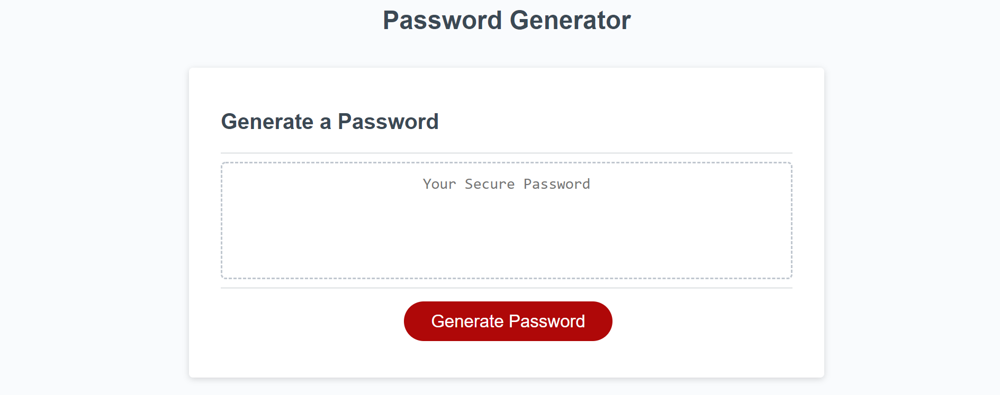
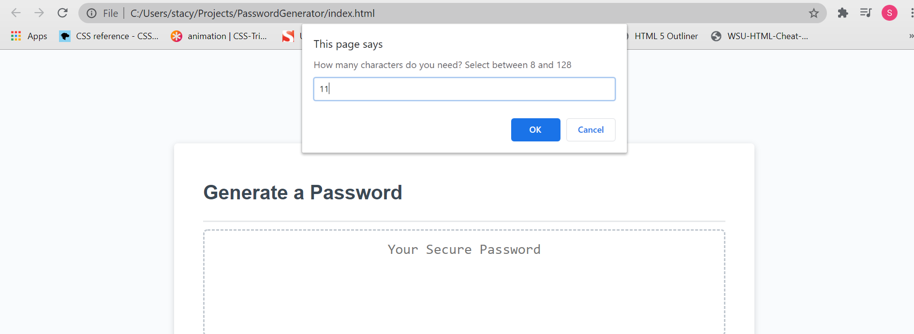
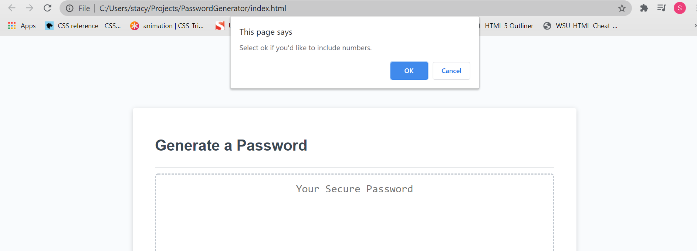
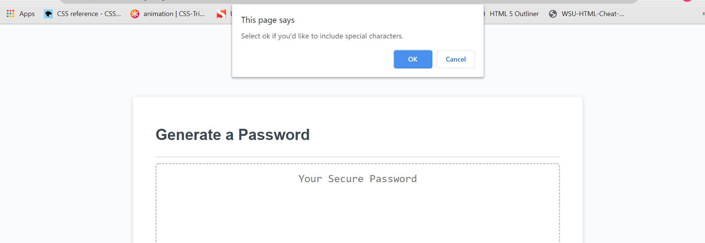
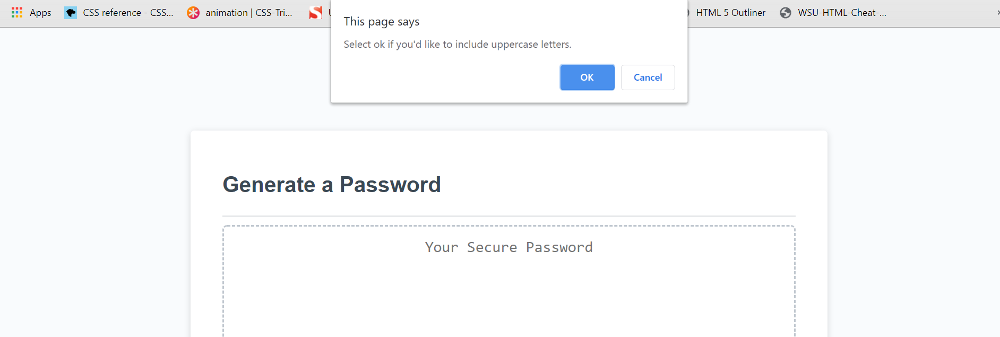
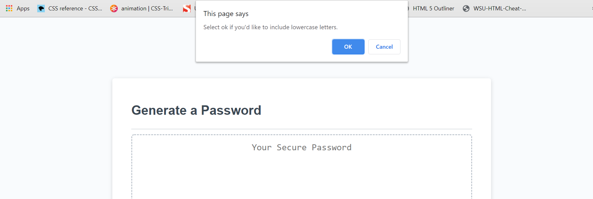
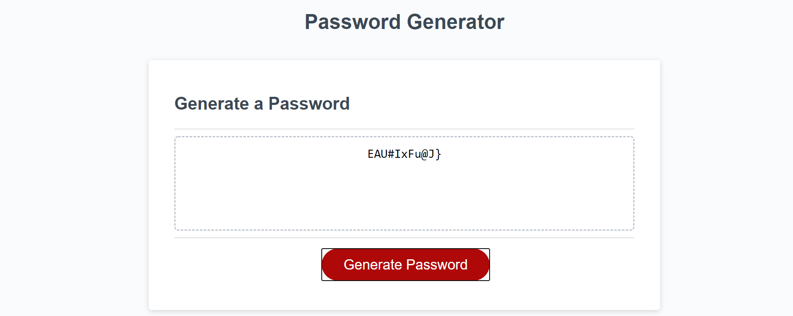

# PasswordGenerator

### Description
* The purpose of this project is to generate a randomized password. The password is created after prompting the user's interest in using numbers, special characters, uppercase and lowercase numbers.  

### Screenshots
* Click on Generate Password

* Confirm amount of characters

  
    
* Confirm to use numbers

  

* Confirm to use special characters

  
  

  * Confirm to use uppercase letters

  
  

  * Confirm to use lowercase letters

  
  

   * Generated Password Output 

  
  

### Deployed Site

* https://stacyo23.github.io/PasswordGenerator/

### Github Page

* https://github.com/stacyo23/PasswordGenerator